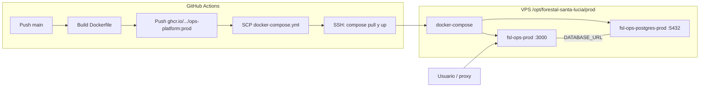

# Arquitectura Docker — Forestal Santa Lucía (ops-platform)

Documentación del despliegue en contenedores para la aplicación **ops-platform** (Next.js). Hay un solo ambiente definido en el repositorio: **producción**.

## Visión general

| Pieza | Rol |
|--------|-----|
| **Imagen `ops-platform`** | Aplicación Next.js en modo `standalone`, con Chromium del sistema para generación de PDF vía Puppeteer. |
| **Contenedor PostgreSQL** | Base de datos `postgres:16-alpine`, solo accesible desde la red interna de Compose. |
| **GitHub Actions** | Construye la imagen, la publica en **GHCR** y despliega en el VPS por SSH. |
| **Docker Compose (prod)** | Orquesta `app` + `postgres`, volúmenes, healthchecks y variables de entorno. |

La aplicación se expone en el host en el puerto **3000** (convención: delante poner Nginx, Caddy o Traefik como proxy TLS).



## Ubicación de archivos en el repositorio

| Ruta | Descripción |
|------|-------------|
| `ops-platform/Dockerfile` | Definición multi-stage de la imagen de la app. |
| `ops-platform/.dockerignore` | Exclusiones del contexto de build. |
| `deploy/prod/docker-compose.yml` | Stack de producción (app + Postgres). |
| `.github/workflows/deploy-prod.yml` | Pipeline de build, push y deploy. |

En el servidor, el compose se copia a:

`/opt/forestal-santa-lucia/prod/docker-compose.yml`

Junto a un archivo **`.env`** (no versionado) generado por el workflow a partir de secretos de GitHub.

## Imagen de la aplicación (`Dockerfile`)

Build con **contexto** `ops-platform/` (raíz efectiva del proyecto Node).

### Etapas

1. **`deps`** (`node:20-alpine`)
   - Instala OpenSSL (requerido por Prisma).
   - `PUPPETEER_SKIP_DOWNLOAD=true` para no descargar Chrome durante `npm ci` (se usa Chromium del sistema en runtime).
   - Copia `package.json`, `package-lock.json`, `prisma/`, `prisma.config.js`.
   - Ejecuta `npm ci` y `npx prisma generate`.

2. **`builder`**
   - Reutiliza `node_modules` y Prisma del stage anterior.
   - Copia el resto del código (`COPY . .`).
   - `npm run build` (Next.js con `output: 'standalone'`).

3. **`runner`** (imagen final)
   - Usuario no root **`nextjs`** (UID 1001).
   - Paquetes Alpine: `dumb-init`, `openssl`, **`chromium`**, fuentes (`ttf-freefont`, `font-noto-emoji`), dependencias típicas de navegador headless (`nss`, `freetype`, `harfbuzz`, `ca-certificates`).
   - Variables por defecto: `PUPPETEER_EXECUTABLE_PATH=/usr/bin/chromium`, `PORT=3000`, `HOSTNAME=0.0.0.0`.
   - Contenido runtime: salida `.next/standalone`, `.next/static`, `public/`, `prisma/`, `prisma.config.js`, `package.json`, y un subconjunto mínimo de `node_modules` (Prisma CLI + `@prisma/*` + `dotenv`) para **`prisma migrate deploy`** y **`prisma generate`** dentro del contenedor.
   - **ENTRYPOINT**: `dumb-init` → **CMD**: `node server.js` (servidor standalone de Next).
   - **HEALTHCHECK**: `GET http://localhost:3000/api/health` debe responder **200**.

### Build local (referencia)

```bash
docker build -f ops-platform/Dockerfile -t fsl-ops:dev ops-platform
```

## Stack Docker Compose (producción)

Servicios definidos en `deploy/prod/docker-compose.yml`:

### Servicio `app`

- **Imagen**: `ghcr.io/${GITHUB_OWNER}/${GITHUB_REPO}/ops-platform:prod`
  - `GITHUB_OWNER` y `GITHUB_REPO` deben ir en **minúsculas** en el `.env` del VPS (el workflow los escribe así desde el nombre del repositorio).
- **Contenedor**: `fsl-ops-prod`
- **Puertos**: `3000:3000` (mapeo al host; el proxy reverso puede apuntar aquí).
- **Red**: `fsl-ops-network` (bridge).
- **Dependencia**: espera a que `postgres` esté **healthy** antes de arrancar de forma ordenada en despliegues manuales; el workflow además levanta Postgres primero de forma explícita.

Variables relevantes (proceden del `.env` del VPS o de valores por defecto en el compose):

- **App / Node**: `NODE_ENV`, `PORT`, `HOSTNAME`, `NEXT_TELEMETRY_DISABLED`
- **Base de datos**: `DATABASE_URL` (apunta al host `postgres` del compose)
- **Auth (Auth.js / NextAuth)**: `NEXTAUTH_URL`, `AUTH_URL`, `NEXTAUTH_SECRET`, `AUTH_SECRET`, `AUTH_TRUST_HOST`
- **PDF**: `PUPPETEER_EXECUTABLE_PATH`, `PUPPETEER_SKIP_DOWNLOAD`
- **Almacenamiento**: `USE_MOCK_STORAGE`, `AWS_REGION`, `AWS_S3_BUCKET`, `AWS_ACCESS_KEY_ID`, `AWS_SECRET_ACCESS_KEY`, `AWS_S3_PUBLIC_BASE_URL`

Healthcheck del servicio alineado con el del Dockerfile (`/api/health`).

### Servicio `postgres`

- **Imagen**: `postgres:16-alpine`
- **Contenedor**: `fsl-ops-postgres-prod`
- **Puerto 5432**: solo **expuesto** en la red interna (no publicado en el host por defecto).
- **Volumen**: `postgres_data` → datos persistentes.
- **Healthcheck**: `pg_isready` con `POSTGRES_USER` y `POSTGRES_DB`.

### Red y volúmenes

- **Red**: `fsl-ops-network` (bridge) — comunicación `app` ↔ `postgres`.
- **Volumen**: `postgres_data` (local), persiste la base entre recreaciones del contenedor.

## Flujo CI/CD (GitHub Actions)

Archivo: `.github/workflows/deploy-prod.yml`

1. **Disparadores**: push a `main` o `workflow_dispatch`.
2. **Job `build`**:
   - Login a **GHCR** con `GITHUB_TOKEN`.
   - Build con `docker/build-push-action`: contexto `./ops-platform`, Dockerfile `./ops-platform/Dockerfile`, plataforma **`linux/amd64`**.
   - Etiquetas: `prod`, `latest`, `prod-<sha>`.
   - Caché Buildx tipo GHA.
3. **Job `deploy`** (entorno **`production`** en GitHub):
   - **SSH previo**: `sudo mkdir` y `chown` en `/opt/forestal-santa-lucia/prod` (el `scp-action` no usa sudo; sin esto el usuario SSH no puede crear rutas bajo `/opt`).
   - Copia `deploy/prod/docker-compose.yml` al VPS (`appleboy/scp-action`, con `overwrite: true` para redeploys).
   - Por SSH: escribe `.env`, `docker login ghcr.io`, `compose pull`, levanta **Postgres**, espera healthy, levanta **app**, ejecuta `npm run prisma:generate` y `npm run prisma:migrate:deploy`, **reinicia** la app, `docker image prune -f`.

Para que el deploy funcione, en GitHub deben existir (como mínimo) secretos típicos: acceso SSH al VPS, credenciales de Postgres, `NEXTAUTH_SECRET`, y la URL pública en variable o secreto (`NEXTAUTH_URL`). El workflow documentado en el YAML detalla nombres sugeridos.

**Requisito en el VPS:** el usuario definido en `VPS_USER` debe poder ejecutar sin contraseña, al menos:

`sudo mkdir`, `sudo chown` bajo `/opt/forestal-santa-lucia`, y los comandos habituales de Docker si el usuario no es root (grupo `docker` o sudo para `docker compose`).

## Generación de PDF en contenedor

- El código usa **Puppeteer** con argumentos seguros para contenedor (`--no-sandbox`, `--disable-setuid-sandbox`, `--disable-dev-shm-usage`, etc.).
- En Docker no se usa el Chrome descargado por Puppeteer: la imagen instala **Chromium de Alpine** y se fija `PUPPETEER_EXECUTABLE_PATH` (en Dockerfile y reforzado en Compose).
- Las fuentes embebidas en la imagen mejoran el render de PDF (texto y emoji básicos).

## Seguridad y operación

- La app corre como usuario **no root** (`nextjs`).
- Secretos no se copian en la imagen: el `.dockerignore` excluye `.env*`.
- El archivo **`.env` en el VPS** debe tener permisos restrictivos (el workflow usa `chmod 600`).
- **TLS y dominio** suelen terminarse en un proxy reverso delante del puerto 3000; `NEXTAUTH_URL` / `AUTH_URL` deben coincidir con la URL pública HTTPS.
- Tras cada despliegue, las **migraciones Prisma** se aplican con `prisma migrate deploy` dentro del contenedor `app`.

## Comandos útiles en el VPS

Desde `/opt/forestal-santa-lucia/prod`:

```bash
docker compose ps
docker compose logs -f app
docker compose exec app npm run prisma:migrate:deploy
```

## Referencias cruzadas

- Variables de aplicación locales: `ops-platform/.env.example`
- Otros documentos en `docs/` (API, storage, esquema de base de datos, etc.)
